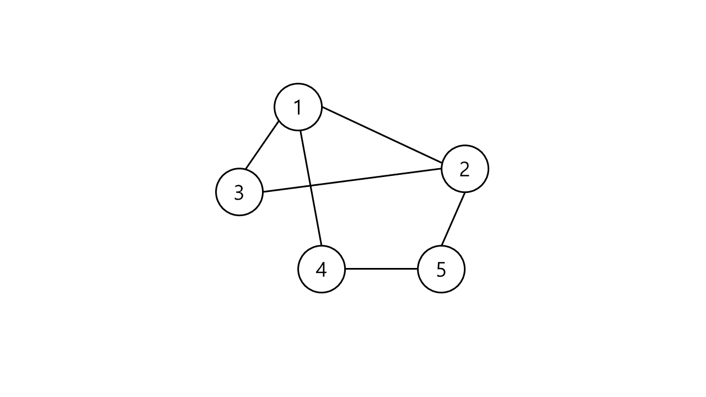
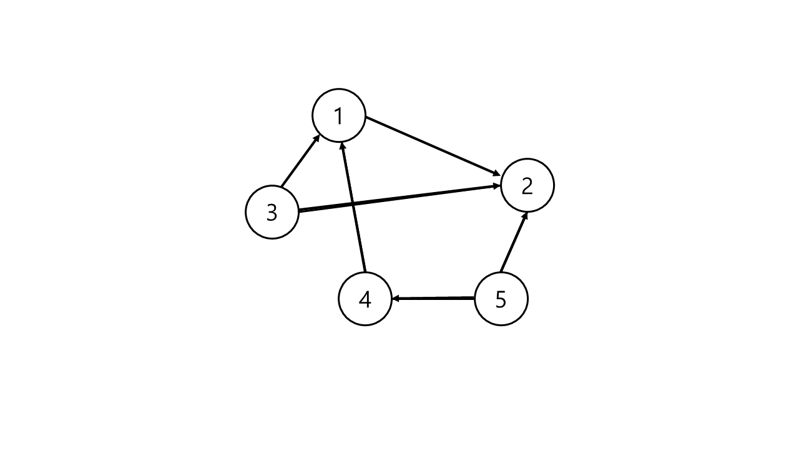
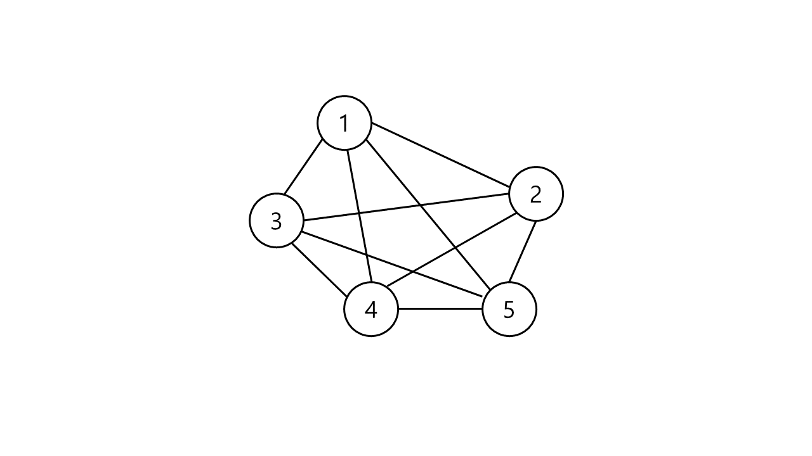
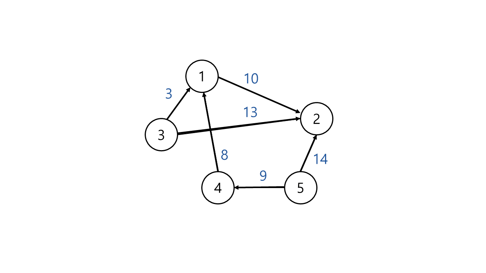

# Graph(그래프)

그래프는 `정점(Vertex)`과 그 사이를 잇는 `간선(Edge)`으로 이루어진다. 
그래프 `G`를 `G = (V, E)`라는, 정점의 집합 `V`와 간선의 집합 `E`라고 표현할 수 있다.
`V(G)`는 그래프 `G`의 정점 집합이고, `E(G)`는 그래프 `G`의 간선 집합이다. 간선은 `(정점 V, 정점 W)` 형식이다.

>### 예시)
> V(G) = {1, 2, 3, 4, 5} 
E(G) = {(1, 2), (3, 1), (3, 2), (4, 1), (5, 2), (5, 4)}

* p.s) 트리도 그래프의 한 종류이다.

## 그래프 용어

- 정점(Vertex): 노드(node), 데이터 저장
- 간선(Edge): 정점을 연결하는 선
- 분지수(차수, degree): 무방향 그래프에서 하나의 정점에 붙어있는 간선 개수
- 내향 분지수(진출 차수, in-degree): 방향 그래프에서 들어오는 간선의 수
- 외향 분지수(진입 차수, out-degree): 방향 그래프에서 나가는 간선의 수
인접
- 인접(adjacent): 두 정점 간에 간선이 있음
- 부속(incident): 정점과 간선 간의 관계
- 경로(path): 출발지에서 목적지로 가는 순서
- 단순 경로(simple path): 경로 중 반복되는 정점이 없음, 한붓그리기처럼 같은 간선 지나지 않음
- 사이클(cycle): 단순 경로의 출발지와 목적지가 같은 경우

## 그래프 종류
여기서는 그래프의 종류 중 대표적으로 무방향, 방향, 완전, 가중치 그래프 4가지를 소개한다. 이 4가지 이외에도 다중 그래프, 다중 에지 등 다양하게 그래프는 존재한다.

### 무방향 그래프(Undirected Graph)

간선에 방향이 없는 그래프이다. 정점 v와 정점 w를 연결하는 간선을 (v, w)라고 하면, (v, w)와 (w, v)는 같은 간선이다.
정점 n개일 때 무방향 그래프가 가질 수 있는 최대 간선 수는 n(n-1)/2개 이다.

### 방향 그래프(Directed Graph)

간선에 방향이 있는 그래프이다. 정점 v에서 w로 가는 간선을 (v, w)라고 하고, 이때는 간선 (w, v)와 다르다.
정점 n개일 때 방향 그래프가 가질 수 있는 최대 간선 수는 n(n-1)개 이다.

### 완전 그래프(Complete graph)

모든 정점에 간선이 있고, 한 정점에서 다른 정점과 모두 연결되어 있다.

### 가중치 그래프(Weighted graph)

간선에 가중치(=소모 비용)가 있다.
